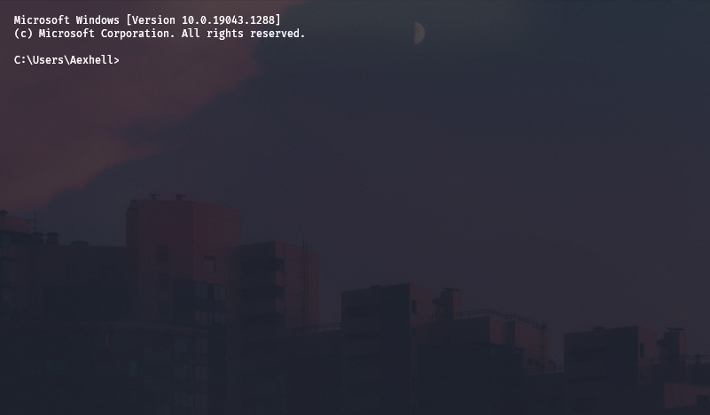

# Sakura ── Windows Terminal Theme

[Background](bg.jpg)

## before-install
* Do a backup of your settings.json file.

## deps
* The [Fira Code](https://fonts.google.com/specimen/Fira+Code) font.

## how-to-install
Open Windows Terminal and go to the Settings tab (You can also press `ctrl+,`). Then, click on "Open JSON file".
Replace it with the "settings.json" repository file. **IMPORTANT!** In the settings.json file, change `<BACKGROUND PATH>` for your preferred background.

Relaunch your terminal and now you have your theme!

## uninstall
If you made a copy of your "settings.json", you can return to your old settings using the backup. If you did not made a backup, try to undo the changes. In the worst case, you must reinstall Windows Terminal.
